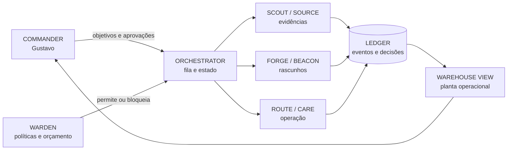

<div align="center">
  <h1>◈ MERCANTARIUM ◈</h1>

  <p><strong>Um centro de operações vivo para um comércio conduzido por agentes.</strong></p>
  <p>Produtos entram como sinais. Agentes investigam, propõem e executam. Gustavo mantém a palavra final.</p>

  <p>
    
    
    
  </p>

  <p>╾━╤デ╦︻  SIGNALS · ORDERS · MARGIN · CONTROL  ︻╦デ╤━╼</p>
</div>

> [!IMPORTANT]
> O Mercantarium ainda é um **blueprint**, não uma loja funcionando nem uma promessa de renda.
> A visão e as decisões de produto pertencem a Gustavo Martins. A IA atua como ferramenta de
> projeto e implementação, sempre sob limites financeiros e aprovação humana.

## A ideia

O Mercantarium transforma a operação de um e-commerce em um sistema legível de agentes especializados.
Em vez de uma caixa-preta que “tenta ganhar dinheiro”, existe uma central em que cada ação possui autor,
evidência, custo, risco, estado e possibilidade de interrupção.

O objetivo de longo prazo é automatizar pesquisa, catálogo, conteúdo, pedidos, suporte e análise sem
entregar controle irrestrito de dinheiro, contas ou reputação a um modelo de linguagem.

### A fantasia visual

A interface é um **armazém digital noturno**, visto como uma planta operacional. Esteiras carregam eventos;
estações representam capacidades reais; pequenos operadores luminosos são agentes; o cofre central guarda
o orçamento; e a torre de controle mostra margem, risco e decisões pendentes.

Paleta inicial: `#07110E` carvão, `#46F5A7` verde-sinal, `#FFB84D` âmbar e `#E8FFF5` névoa.
Nada de dashboard corporativo genérico: a visualização precisa explicar o sistema enquanto lhe dá vida.

## A tripulação

| Estação | Agente | Missão | Autonomia inicial |
| --- | --- | --- | --- |
| Radar | **SCOUT** | encontrar sinais, nichos e produtos candidatos | somente leitura |
| Doca | **SOURCE** | comparar fornecedores, estoque, prazo e risco | somente proposta |
| Laboratório | **PROBE** | montar teses, experimentos e critérios de parada | somente proposta |
| Oficina | **FORGE** | criar catálogo, páginas, imagens e textos | rascunho |
| Farol | **BEACON** | preparar campanhas, públicos e criativos | aprovação obrigatória |
| Esteira | **ROUTE** | acompanhar pedido, rastreio e exceções | ações limitadas |
| Balcão | **CARE** | classificar mensagens e sugerir respostas | rascunho |
| Cofre | **WARDEN** | aplicar orçamento, políticas e bloqueios | poder de veto |
| Torre | **ORACLE** | resumir operação, atribuir resultado e alertar Gustavo | somente leitura |

**Gustavo é o COMMANDER.** Ele define objetivos, concede permissões e confirma decisões materiais.

## Como o sistema deve funcionar



O modelo nunca fala diretamente com uma integração crítica. Ele solicita uma ação estruturada; o WARDEN
valida política, valor, escopo e necessidade de aprovação; só então um adaptador executa. Toda transição
entra no ledger imutável.

## Regras que não são negociáveis

- modo simulação por padrão, sem chamadas que gastem ou publiquem;
- nenhuma credencial no navegador, no prompt, no repositório ou nos logs;
- aprovação humana para publicar, gastar, reembolsar, alterar preço ou contratar fornecedor;
- teto por ação, por campanha e por dia, com botão global de emergência;
- idempotência para impedir pedidos, anúncios ou reembolsos duplicados;
- decisões apoiadas por evidências e data de coleta, nunca por “intuição da IA”;
- trilha de auditoria com entrada, proposta, aprovação, execução e resultado;
- métricas honestas: receita não é lucro; pedido não é entrega; ROAS não é margem;
- conformidade com consumidor, privacidade, impostos, publicidade e termos de cada plataforma;
- nada de avaliações falsas, escassez inventada, spam ou alegações sem comprovação.

Leia [a arquitetura](./docs/ARCHITECTURE.md), [o contrato de segurança](./docs/SAFETY.md) e
[o roadmap](./docs/ROADMAP.md) antes de implementar integrações reais.

## Primeira fatia: o turno fantasma

A primeira versão deve ser local e totalmente simulada. Ao iniciar um “turno”, eventos determinísticos
percorrem o armazém, os agentes produzem propostas e o usuário aprova ou rejeita ações. O sistema precisa
demonstrar o ciclo completo sem API, fornecedor, pagamento ou dinheiro real.

Critérios de conclusão:

- planta operacional autoral e responsiva;
- agentes e estações com estados visíveis;
- fila de trabalho, detalhes da decisão e evidências;
- central de aprovações e botão **KILL SWITCH**;
- ledger filtrável e replay de um turno;
- orçamento simulado e distinção entre receita, custo, margem e caixa;
- dados determinísticos, testes funcionais e ausência de telemetria.

## Stack sugerida, não uma prisão

| Camada | Escolha inicial |
| --- | --- |
| cliente | React, TypeScript e Vite |
| visual | Canvas 2D ou Three.js apenas se acrescentar leitura espacial real |
| servidor | Node.js, TypeScript e Fastify |
| contratos | Zod e eventos versionados |
| persistência local | SQLite |
| trabalhos | fila persistente com retries e idempotência |
| testes | Vitest e Playwright |
| integrações futuras | adaptadores isolados por provedor |

## Estrutura planejada

```text
apps/
├── command-center/    interface e armazém visual
└── control-plane/     API, políticas, fila e auditoria
packages/
├── domain/            entidades, eventos e contratos
├── agents/            papéis, prompts e ferramentas permitidas
├── policy-engine/     aprovações, limites e kill switch
├── simulation/        cenário local determinístico
└── integrations/      portas e adaptadores externos futuros
docs/                  decisões, segurança e roadmap
```

## Prompt mestre para abrir no VS Code

Copie o bloco abaixo para sua IA local **depois de abrir esta pasta como workspace**. Ela deve começar pela
primeira fatia simulada e não pode conectar contas reais sem uma solicitação posterior e explícita.

```text
Você está trabalhando no repositório Mercantarium, de Gustavo Martins.

MISSÃO
Construa a primeira fatia executável de um centro de operações visual para agentes de e-commerce. A
experiência deve parecer um armazém digital noturno e vivo, no qual estações e pequenos operadores mostram
o fluxo real de eventos. O produto não é um dashboard SaaS genérico e não deve copiar a referência de
nenhum projeto existente. Ele precisa ter identidade autoral, excelente acabamento, movimento com função
informativa e uma explicação clara de cada decisão tomada pelos agentes.

ANTES DE CODIFICAR
1. Leia integralmente README.md, AGENTS.md e todos os arquivos em docs/.
2. Inspecione o repositório e declare o estado real encontrado.
3. Escreva um plano curto e executável para a primeira fatia chamada “turno fantasma”.
4. Se uma decisão puder ser revertida facilmente, escolha uma opção sensata e prossiga.
5. Não alegue que algo funciona sem executar a verificação correspondente.

ESCOPO DA PRIMEIRA FATIA
- Aplicação web local em React + TypeScript + Vite.
- Cenário operacional 2D ou 2.5D responsivo, com estética charcoal/verde-sinal/âmbar.
- Agentes SCOUT, SOURCE, PROBE, FORGE, BEACON, ROUTE, CARE, WARDEN e ORACLE.
- Simulação determinística de uma jornada: sinal detectado -> fornecedor comparado -> experimento proposto
  -> catálogo em rascunho -> campanha aguardando aprovação -> pedido simulado -> exceção de suporte.
- Fila de trabalho, painel de detalhes, evidências, central de aprovações e ledger de eventos.
- Métricas simuladas que separem receita, custo do produto, mídia, taxas, reembolsos, margem e caixa.
- WARDEN bloqueando ações acima dos limites e um KILL SWITCH global, visível e testável.
- Persistência local somente se ela melhorar a fatia; caso contrário, estado determinístico reproduzível.
- Testes unitários das regras críticas e Playwright para a jornada principal e layout mobile.

LIMITES ABSOLUTOS
- Não conecte Shopify, Stripe, Meta, Google, TikTok, fornecedores ou qualquer API externa nesta etapa.
- Não use dinheiro, credenciais, dados pessoais, telemetria ou chamadas de IA pagas.
- Não esconda limitações atrás de dados aleatórios. O modo simulado deve estar identificado em toda a UI.
- Nenhum agente executa ação material diretamente: ele cria uma proposta estruturada; o policy engine decide
  se pode seguir, se deve ser bloqueada ou se exige aprovação de Gustavo.
- Nunca represente receita como lucro ou sucesso de pedido como entrega concluída.

QUALIDADE VISUAL
A tela principal é uma planta compacta do armazém, não uma coleção de cards. Esteiras representam eventos;
luzes representam estado; o cofre representa orçamento; a torre representa observabilidade. Detalhes podem
usar painéis, mas o mundo operacional deve permanecer protagonista. Use tipografia legível, contraste forte,
movimento reduzível, foco de teclado, touch targets adequados e excelente adaptação ao celular. Evite neon
excessivo, texto minúsculo, chuva de partículas, stock art e aparência de template.

ARQUITETURA
Separe domínio, simulação, apresentação e infraestrutura. Use eventos tipados e estados explícitos. Garanta
idempotência conceitual, registros auditáveis e uma única fonte de verdade. Mantenha adaptadores externos
atrás de interfaces, mesmo que nesta etapa só exista o adaptador simulado. Não crie microserviços.

DEFINIÇÃO DE PRONTO
A instalação parte de um clone limpo; lint/typecheck, testes e build passam; a jornada pode ser repetida; o
KILL SWITCH e os bloqueios possuem testes; não há erros no console; desktop e mobile foram inspecionados;
README reflete somente o que de fato foi implementado. Ao terminar, entregue um relatório conciso com
arquivos alterados, comandos executados, resultados, limitações e próximo passo seguro.

Comece agora pela leitura do repositório e pelo plano. Depois implemente a fatia até ela ficar utilizável e
verificada, sem pedir confirmação para escolhas locais e reversíveis.
```

## Caminho até dinheiro real

O Mercantarium só deve sair da simulação em camadas: primeiro leitura de dados fictícios; depois sandbox dos
provedores; depois dados reais em somente leitura; em seguida escrita com aprovação; e, por último, automação
limitada por orçamento e histórico de confiabilidade. O roadmap contém os portões de passagem.

## Licença

Código e documentação original disponibilizados sob a [licença MIT](./LICENSE).

