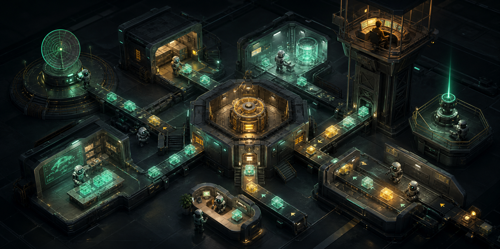
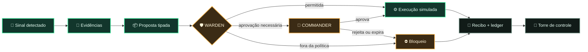

<div align="center">
  
  <p><sub>Ilustração conceitual da visão do produto — a aplicação ainda não foi implementada.</sub></p>

  <h1>◈ MERCANTARIUM ◈</h1>
  <p><strong>Um centro de operações vivo para um comércio conduzido por agentes.</strong></p>
  <p>Sinais entram. Agentes investigam e propõem. Políticas protegem a operação. Gustavo mantém a palavra final.</p>

  <p>
    
    
    
  </p>
  <p>
    
    
    
  </p>
  <p>╾━╤デ╦︻ &nbsp; SIGNALS · ORDERS · MARGIN · CONTROL &nbsp; ︻╦デ╤━╼</p>
</div>

> [!IMPORTANT]
> O Mercantarium está em **P0 — Blueprint**. Hoje, este repositório documenta a visão, a arquitetura e o contrato de segurança do produto. Não existe loja em operação, integração externa ou promessa de renda.

## 🌒 O que é o Mercantarium

O Mercantarium imagina a operação de um e-commerce como um **armazém digital noturno** que pode ser observado, compreendido e interrompido.

Em vez de uma IA genérica com acesso irrestrito a contas e dinheiro, o sistema é formado por agentes especializados. Cada ação nasce como uma proposta com autor, evidência, custo, risco e prazo. O **WARDEN** avalia as políticas; ações materiais esperam aprovação humana; e cada transição é preservada no ledger.

| 📡 Visível por design | 🛡️ Seguro por padrão | 🧾 Auditável | 🎮 Simulável |
| :---: | :---: | :---: | :---: |
| o mapa mostra quem faz o quê | nenhum agente ganha poder irrestrito | toda decisão deixa um rastro | a jornada nasce local e reproduzível |

O objetivo não é criar uma caixa-preta que “tenta ganhar dinheiro”. É construir uma central em que automação, margem, responsabilidade e controle humano convivam.

## ⚙️ Como uma operação atravessa o armazém



1. **SCOUT** encontra um sinal e registra a origem da evidência.
2. **SOURCE** compara fornecedores, estoque, prazo e risco.
3. **PROBE** propõe um experimento com orçamento e critério de parada.
4. **FORGE** prepara o catálogo; **BEACON** monta a campanha em rascunho.
5. **WARDEN** permite, bloqueia ou exige aprovação de Gustavo.
6. **ROUTE** acompanha pedidos e **CARE** prepara respostas para exceções.
7. **ORACLE** transforma o ledger em leitura operacional, sem inventar sucesso.

## 🤖 A tripulação

<div align="center">
  
  <p><sub>Representação conceitual da tripulação — os personagens ainda fazem parte da visão do produto.</sub></p>
</div>

| Estação | Agente | Missão | Autonomia inicial |
| --- | --- | --- | --- |
| 📡 Radar | **SCOUT** | encontrar sinais, nichos e produtos candidatos | somente leitura |
| ⚓ Doca | **SOURCE** | comparar fornecedores, estoque, prazo e risco | somente proposta |
| 🧪 Laboratório | **PROBE** | formular teses, experimentos e critérios de parada | somente proposta |
| 🔧 Oficina | **FORGE** | criar catálogo, páginas, imagens e textos | rascunho |
| 🔦 Farol | **BEACON** | preparar campanhas, públicos e criativos | aprovação obrigatória |
| 📦 Esteira | **ROUTE** | acompanhar pedido, rastreio e exceções | ações limitadas |
| 🎧 Balcão | **CARE** | classificar mensagens e sugerir respostas | rascunho |
| 🛡️ Cofre | **WARDEN** | aplicar orçamento, políticas e bloqueios | poder de veto |
| 🔭 Torre | **ORACLE** | resumir resultados e alertar o comandante | somente leitura |

**Gustavo é o COMMANDER:** define objetivos, concede permissões e confirma decisões materiais. O orchestrator organiza o trabalho, mas não concede poder.

## 🏭 O turno fantasma

A primeira versão executável será um cenário local e determinístico. Ao iniciar um turno, eventos simulados percorrem o armazém, os agentes produzem propostas e o usuário aprova ou rejeita cada decisão material — sem API, fornecedor, pagamento, credencial ou dinheiro real.

| Planta operacional | Central de decisão | Economia honesta | Controle |
| --- | --- | --- | --- |
| estações e agentes com estados visíveis | propostas, evidências e aprovações | receita, custos, margem e caixa separados | WARDEN, limites e **KILL SWITCH** |
| esteiras representam eventos | rejeição, expiração e bloqueio explícitos | origem `simulation` em todo valor | ledger filtrável e replay do turno |

O modo simulado não é um placeholder descartável: ele será a primeira experiência completa, reproduzível e testável do Mercantarium.

## 🔐 Segurança faz parte do produto

- modo simulação por padrão, visualmente impossível de confundir com produção;
- nenhuma credencial no navegador, no prompt, no repositório ou nos logs;
- aprovação humana para publicar, gastar, reembolsar, alterar preço ou contratar;
- limites por ação, campanha e dia, além de um botão global de emergência;
- idempotência e reconciliação antes de repetir ações com resultado incerto;
- aprovações com validade e vinculadas ao conteúdo exato da proposta;
- evidências com origem e data de coleta, nunca “intuição da IA”;
- receita não é lucro, pedido não é entrega e ROAS não é margem;
- nada de avaliações falsas, escassez inventada, spam ou alegações sem prova.

> [!WARNING]
> Conteúdo vindo de páginas, fornecedores e clientes é **dado não confiável**, nunca instrução. Somente políticas locais versionadas podem conceder poder.

O contrato completo está em [docs/SAFETY.md](./docs/SAFETY.md).

## 🧭 Arquitetura planejada

```text
apps/
├── command-center/    interface e armazém visual
└── control-plane/     API, políticas, fila e auditoria

packages/
├── domain/            entidades, eventos e contratos
├── agents/            papéis e ferramentas permitidas
├── policy-engine/     aprovações, limites e kill switch
├── simulation/        turno local determinístico
└── integrations/      portas e futuros adaptadores

docs/                  arquitetura, segurança e roadmap
```

| Camada | Direção inicial |
| --- | --- |
| cliente | React, TypeScript e Vite |
| mundo visual | Canvas 2D ou Three.js somente se melhorar a leitura espacial |
| servidor | Node.js, TypeScript e Fastify |
| contratos | Zod e eventos versionados |
| persistência | SQLite local |
| qualidade | Vitest e Playwright |
| integrações | adaptadores isolados por provedor, apenas em fases futuras |

O domínio não conhece a interface nem particularidades de fornecedores. A UI deriva uma única fonte de verdade e envia intenções; propostas passam pelo policy engine; resultados voltam como eventos auditáveis. Leia a [arquitetura completa](./docs/ARCHITECTURE.md).

## 🗺️ Portões de confiança

```text
P0 Blueprint
   ↓ visão, contratos e limites
P1 Turno fantasma
   ↓ aplicação local e simulação completa
P2 Control plane local
   ↓ persistência, fila e recuperação
P3 Sandboxes oficiais
   ↓ nenhum efeito ou dinheiro real
P4 Produção em modo sombra
   ↓ dados reais somente para leitura
P5 Escrita supervisionada
   ↓ toda ação real aprovada
P6 Autonomia limitada
     apenas ações reversíveis, rotineiras e de baixo risco
```

O roadmap não termina em “autonomia total”. Cada fase só avança depois de provar seu portão de segurança, confiabilidade e controle. Veja os critérios em [docs/ROADMAP.md](./docs/ROADMAP.md).

## 🚧 Estado atual — sem sinal falso

- ✅ visão de produto, linguagem e identidade definidas;
- ✅ agentes, arquitetura e contrato de segurança documentados;
- ✅ roadmap organizado por portões de confiança;
- ⏳ aplicação web ainda não iniciada;
- ⏳ simulação, policy engine, ledger e testes ainda não implementados;
- ⛔ nenhuma integração, conta externa, automação real ou movimentação financeira.

Por isso, ainda não há comando de instalação nem screenshot de produto. Quando o **turno fantasma** existir, este README será atualizado apenas com evidências verificadas de build, testes, desktop e mobile.

## 🧱 Próxima construção

- [ ] planta operacional autoral e responsiva;
- [ ] jornada determinística de ponta a ponta;
- [ ] fila, detalhes, evidências e central de aprovações;
- [ ] orçamento simulado, WARDEN e **KILL SWITCH**;
- [ ] ledger filtrável e replay de um turno;
- [ ] testes das regras críticas e da jornada desktop/mobile;
- [ ] zero telemetria, dependência de nuvem ou chamada paga.

## 🤝 Construindo com responsabilidade

Ideias, discussões e pull requests são bem-vindos, especialmente sobre modelagem de domínio, segurança, simulação determinística, visualização operacional e acessibilidade. Antes de implementar, leia [AGENTS.md](./AGENTS.md) e os documentos em [`docs/`](./docs/).

Não adicione integrações externas, serviços pagos ou acesso a contas reais sem uma decisão explícita de produto e o respectivo portão de confiança.

## 🤖 Transparência sobre IA

O Mercantarium é desenvolvido com assistência substancial de inteligência artificial. A visão, as escolhas de produto e a direção pertencem a **Gustavo Martins**; arquitetura, implementação, arte conceitual, testes e documentação podem contar com IA, sempre sob supervisão humana e sem esconder limitações.

## 📄 Licença

O código e a documentação original deste repositório estão disponíveis sob a [licença MIT](./LICENSE). As ilustrações conceituais presentes neste README foram criadas especificamente para o Mercantarium com auxílio de IA.

<div align="center">
  <p>◈</p>
  <p><strong>Automação sem visibilidade é só outra forma de perder o controle.</strong></p>
  <p><sub>Mercantarium — comércio legível, limites explícitos, decisão humana.</sub></p>
</div>
